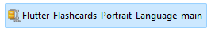

## Download and unpack your zip file  

Which app opens ZIP files?
In summary, if you have a zip file that is on your Android device, all you need to access it is through an app like "WinZip." The application should allow you to explore all of the files in your phone's directories.  

How do I unzip files for free online?
Simply select and upload . ZIP file and press Unzip button. XConvert Archive Tool will unpack . ZIP file and let you download individual files.  

https://www.xconvert.com/unzip-files

How do I download a zip folder?
To download a ZIP file, click on a link to it; this will prompt your browswer to ask you if you would like to open or save the file. Select Save. The IE , Safari, and Opera Web browsers will bring up a second dialog box asking you where on your computer you would like to save the file.  

https://www.nimh.nih.gov/site-info/zip

Bevor Sie beginnen
Bevor Sie Firebase-Hosting einrichten können, müssen Sie ein Firebase-Projekt erstellen .  

https://firebase.google.com/docs/hosting/quickstart

Schritt 1 : Installieren Sie die Firebase-CLI
Besuchen Sie die Firebase CLI-Dokumentation, um zu erfahren, wie Sie die CLI installieren oder auf die neueste Version aktualisieren .

Schritt 2 : Initialisieren Sie Ihr Projekt
Um Ihre lokalen Projektdateien mit Ihrem Firebase-Projekt zu verbinden, führen Sie den folgenden Befehl im Stammverzeichnis Ihres lokalen Projektverzeichnisses aus:

firebase init hosting
Während der Projektinitialisierung werden von der Firebase-CLI folgende Eingabeaufforderungen angezeigt:

Wählen Sie ein Firebase-Projekt aus, um eine Verbindung zu Ihrem lokalen Projektverzeichnis herzustellen.

Das ausgewählte Firebase-Projekt ist Ihr „Standard“-Firebase-Projekt für Ihr lokales Projektverzeichnis. Um zusätzliche Firebase-Projekte mit Ihrem lokalen Projektverzeichnis zu verbinden, richten Sie Projektaliase ein .

Geben Sie ein Verzeichnis an, das als Ihr öffentliches Stammverzeichnis verwendet werden soll.

Dieses Verzeichnis enthält alle Ihre öffentlich bereitgestellten statischen Dateien, einschließlich Ihrer index.html -Datei und aller anderen Assets, die Sie auf Firebase Hosting bereitstellen möchten.

Der Standardwert für das öffentliche Stammverzeichnis heißt public .

Sie können Ihr öffentliches Stammverzeichnis jetzt oder später in Ihrer Konfigurationsdatei firebase.json angeben.

Wenn Sie die Standardeinstellung auswählen und noch kein Verzeichnis mit dem Namen public haben, erstellt Firebase es für Sie.

Wenn Sie noch keine gültige index.html -Datei oder 404.html -Datei in Ihrem öffentlichen Stammverzeichnis haben, erstellt Firebase diese für Sie.

https://firebase.google.com/support/guides/launch-checklist  

